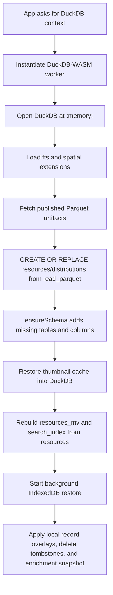

# Data Store Architecture

OpenGeoMetadata Studio uses a browser-native data store with two layers:

1. Published Parquet artifacts served from `web/public/`.
2. Local browser persistence in IndexedDB, restored into DuckDB-WASM at runtime.

DuckDB-WASM is the query engine. It runs in the browser in memory, then the app reconstructs that in-memory database from the published baseline plus local overlays whenever the page loads.

## Why It Works This Way

The app needs three properties that usually pull in different directions:

| Need | Data-store answer |
| --- | --- |
| Fast public startup | Load compact Parquet files over HTTP and query them with DuckDB-WASM. |
| No required backend | Run DuckDB entirely in the browser. |
| Local editing and enrichment | Persist local records, deletes, thumbnails, and enrichment workbench state in IndexedDB. |
| Git-friendly publishing | Write Parquet artifacts back into `web/public/` and commit them. |

The important mental model is:

```text
published Parquet baseline + IndexedDB local overlay -> in-memory DuckDB session
```

The committed Parquet files are the shared/public catalog. IndexedDB is the user's local working copy.

## Main Files

| File | Role |
| --- | --- |
| `web/src/duckdb/dbInit.ts` | Initializes DuckDB-WASM, loads Parquet, restores IndexedDB overlays, and manages IndexedDB helpers. |
| `web/src/duckdb/schema.ts` | Defines DuckDB tables and schema migrations. |
| `web/src/duckdb/import.ts` | Imports CSV, JSON, and DuckDB snapshots into DuckDB. |
| `web/src/duckdb/mutations.ts` | Applies resource, delete, thumbnail, static-map, H3, and embedding mutations. |
| `web/src/duckdb/queries.ts` | Search, facets, resource fetches, distributions, map hexes, and cache lookups. |
| `web/src/duckdb/export.ts` | Creates resource and distribution Parquet files plus JSON/CSV export blobs. |
| `web/src/duckdb/lifecycle.ts` | Persists resources/enrichment snapshots and exports `.duckdb` backups. |
| `web/src/duckdb/enrichments.ts` | Stores enrichment workbench profiles, staged assets, runs, drafts, and revisions. |
| `web/src/config/parquetArtifacts.ts` | Resolves published Parquet file names from Vite env vars. |
| `web/src/publish/publishToRepo.ts` | Writes current browser data into `web/public/` Parquet artifacts through the File System Access API. |
| `web/scripts/build-db.cjs` | Build-time Parquet preparation from local metadata JSON or existing published Parquet. |

For table-level details, see [Database Schema](./database_schema.md).

## Published Parquet Baseline

The public app looks for these files under the Vite base URL:

```text
web/public/resources.parquet
web/public/resource_distributions.parquet
```

`resources.parquet` is reserved as the empty starter artifact. Forks that publish real data should set a named resources artifact:

```bash
VITE_RESOURCES_PARQUET=resources.my-library.parquet
```

The distributions artifact is derived from the resources artifact unless explicitly configured:

```bash
VITE_RESOURCE_DISTRIBUTIONS_PARQUET=resource_distributions.my-library.parquet
```

Naming behavior lives in `web/src/config/parquetArtifacts.ts`:

| Resources artifact | Default companion distributions artifact |
| --- | --- |
| `resources.parquet` | `resource_distributions.parquet` |
| `resources.my-library.parquet` | `resource_distributions.my-library.parquet` |
| `snapshots/resources-2026.parquet` | `snapshots/resource_distributions-2026.parquet` |
| `catalog.parquet` | `catalog.distributions.parquet` |

## Startup Flow

`getDuckDbContext()` in `dbInit.ts` is the entrypoint. It creates a singleton DuckDB context for the browser tab.



DuckDB first tries the exception-handling WASM bundle, then falls back to the MVP bundle if needed:

```text
duckdb-eh.wasm
duckdb-mvp.wasm
```

The database is opened at `:memory:`. Current persistence is handled by Parquet plus IndexedDB records, not by keeping DuckDB's live database file mounted as the primary store.

## Parquet Bootstrap

`loadInitialDataFromParquet()`:

1. Resolves URLs from `BASE_URL` plus `PARQUET_ARTIFACTS`.
2. Fetches resources with `cache: "no-cache"`.
3. Fetches distributions only when resources are available.
4. Registers each fetched Parquet buffer with DuckDB-WASM.
5. Runs `CREATE OR REPLACE TABLE ... AS SELECT * FROM read_parquet(...)`.
6. Drops the registered in-memory file.

When the default starter artifact is missing or empty, the app treats that as an intentional empty baseline for new forks.

After Parquet load, `ensureSchema()` still runs. That lets older Parquet artifacts keep working when the app adds columns such as H3 indexes, `geom`, `embedding`, or distribution labels.

## IndexedDB Layout

IndexedDB database:

```text
aardvark-duckdb
```

Current version:

```text
4
```

Object stores:

| Store | Keying | Purpose |
| --- | --- | --- |
| `database` | Arbitrary keys | Metadata records, deleted IDs, enrichment snapshot, legacy full snapshots, and legacy `records.duckdb` bytes. |
| `records` | `id` keyPath | Structured Aardvark JSON records used as the local overlay. |
| `thumbnails` | `id` keyPath | Base64 thumbnail cache records. |

Important keys in the `database` store:

| Key | Meaning |
| --- | --- |
| `records.meta.json` | Tracks whether local records are dirty, record count, source, saved time, and mode (`full` or `overlay`). |
| `records.deleted.ids.json` | Tombstones for records deleted locally from a published Parquet baseline. |
| `records.snapshot.json` | Legacy JSON snapshot used for migration. |
| `enrichments.snapshot.json` | Serialized enrichment workbench tables. |
| `records.duckdb` | Legacy database-file persistence surface. New startup does not depend on it. |
| `starter.empty-baseline.resources-reset.v1` | Marker used to clear stale local records once when using the empty starter baseline. |

## Overlay Modes

Local resource persistence has two modes:

| Mode | Meaning | Typical source |
| --- | --- | --- |
| `overlay` | IndexedDB records are local additions or edits layered on top of published Parquet. | Normal app edits, enrichment publishing, deletes. |
| `full` | IndexedDB records represent the whole catalog. | Full local import or older save flows. |

When a published Parquet baseline exists and IndexedDB contains an older full snapshot, startup migrates that snapshot to an overlay by comparing local record IDs against published IDs. Records already present in Parquet are dropped from the local overlay; local-only records are kept.

That keeps the browser from duplicating the entire public catalog in IndexedDB after a catalog has been published.

## Background Restore

`startBackgroundRestore()` runs after the Parquet baseline and schema are ready.

It decides whether local resources should be restored:

| Condition | Restore resources from IndexedDB? |
| --- | --- |
| No published Parquet baseline loaded | Yes. |
| `records.meta.json.dirty === true` | Yes. |
| No meta exists and the app is not using the empty starter baseline | Yes, to support older local caches. |
| Published Parquet baseline loaded and local records are clean | No; use Parquet directly. |

Restore order:

1. Load structured records from the `records` store.
2. If none exist, migrate legacy `records.snapshot.json` when present.
3. If Parquet is loaded and records are not already overlay mode, keep only local-only records.
4. Import records into DuckDB using `importJsonData()` for overlays or `replaceAllJsonData()` for full snapshots.
5. Apply delete tombstones from `records.deleted.ids.json`.
6. Restore enrichment workbench tables from `enrichments.snapshot.json`.
7. Ensure default enrichment definitions/profile rows exist.

Restore progress is published through browser events:

```text
duckdb-restore-progress
duckdb-restored
```

## DuckDB Tables In Memory

The core tables are:

| Table | Purpose |
| --- | --- |
| `resources` | Scalar Aardvark fields, spatial geometry, embedding, H3 columns. |
| `resources_mv` | Repeatable fields as long-form `(id, field, val)` rows. |
| `distributions` | Resource links parsed from `dct_references_s` or edited directly. |
| `search_index` | Simple text blob for global search. |
| `resources_image_service` | Thumbnail cache restored from IndexedDB. |
| `static_maps` | Static map preview cache for the current session. |

Enrichment workbench tables are also created in the same DuckDB instance:

```text
storage_profiles
model_profiles
staged_assets
asset_derivatives
prompts
prompt_versions
enrichment_definitions
enrichment_batches
enrichment_runs
resource_enrichments
aardvark_drafts
resource_revisions
```

DuckDB is the working query engine. IndexedDB is the persistence layer.

## Derived Indexes

The app derives several query helpers from the resource records:

| Derived data | Built by | Used for |
| --- | --- | --- |
| `resources_mv` | JSON import and Parquet rebuild | Facets and repeatable-field filters. |
| `search_index` | JSON import and Parquet rebuild | Global keyword search. |
| `geom` | Import/upsert/backfill from `dcat_bbox` or `locn_geometry` | Spatial intersection search. |
| `dcat_centroid` | Import/upsert/backfill from geometry when missing | Map display and H3 indexing. |
| `h3_res2` through `h3_res8` | Import/upsert/build/backfill from centroid | Map hex aggregation. |
| `embedding` | `embedding.worker` | Semantic-neighbor style features. |

When Parquet is loaded, `rebuildDerivedIndexesFromResources()` rebuilds `resources_mv` and `search_index` from the `resources` table. This keeps published Parquet compact while preserving fast faceting/search at runtime.

## Reads

The UI generally goes through `DatabaseService`, which wraps `src/duckdb` functions.

| UI need | Query path |
| --- | --- |
| Dashboard search | `facetedSearch()` |
| Basic list search | `searchResources()` |
| Resource show page | `queryResourceById()` and `getDistributionsForResource()` |
| Facet popovers | `getFacetValues()` |
| Map hexes | `getMapH3()` |
| Distribution manager | `queryDistributions()` |
| Thumbnail/static map lookup | `getThumbnail()` and `getStaticMap()` |

`fetchResourcesByIds()` reconstructs full `Resource` objects by joining scalar `resources`, repeatable `resources_mv`, distribution rows, and cached thumbnails.

## Writes

### Resource Upsert

`upsertResource()`:

1. Deletes old rows for that resource ID from `resources`, `resources_mv`, and `distributions`.
2. Normalizes geometry and centroid fields.
3. Inserts scalar fields into `resources`.
4. Populates `geom` and H3 columns when possible.
5. Inserts repeatable fields into `resources_mv`.
6. Inserts distribution rows.
7. Rebuilds `search_index` for the resource.
8. Saves the Aardvark JSON record to the IndexedDB `records` store as an overlay.

The saved overlay includes `dct_references_s` rebuilt from the distribution rows, so reloads can reconstruct distributions from local records.

### Resource Delete

`deleteResource()`:

1. Deletes the resource from live DuckDB tables.
2. Deletes the overlay record from the `records` store.
3. Adds the ID to `records.deleted.ids.json`.

The tombstone matters when the resource still exists in published Parquet. Without the tombstone, the record would reappear on the next page load.

### Full Save

`saveDb()` persists:

| Option | Behavior |
| --- | --- |
| `resourcesDirty: true` or omitted | Queries all resources, converts them to Aardvark JSON, and writes them into the `records` store. |
| `resourcesDirty: false` | Saves only enrichment workbench state. |

Either way, `saveDb()` also stores the enrichment snapshot in `enrichments.snapshot.json`.

Most enrichment-table mutations call `saveDb({ resourcesDirty: false })` so resource overlays are not rewritten unnecessarily.

## Thumbnail And Static Map Caches

Thumbnails and static maps are cache data, not authoritative metadata.

| Cache | In DuckDB | In IndexedDB | Notes |
| --- | --- | --- | --- |
| Thumbnails | `resources_image_service` | `thumbnails` store | Persisted across reloads and restored into DuckDB at startup. |
| Static maps | `static_maps` | Not currently persisted by the same helper | Session-local DuckDB cache. |

`upsertThumbnail()` writes both to DuckDB and IndexedDB. `restoreThumbnailCacheIntoDuckDb()` reloads thumbnail records into DuckDB on startup.

## Import Paths

| Input | Function | Persistence behavior |
| --- | --- | --- |
| Aardvark JSON | `importJsonData()` | Upserts records and saves to IndexedDB unless `skipSave` is true. |
| Full JSON replace | `replaceAllJsonData()` | Replaces live resources and saves unless `skipSave` is true. |
| CSV resources | `importCsv()` | Imports scalar/repeatable fields and saves. |
| CSV distributions | `importCsv()` heuristic | Inserts distribution rows and saves. |
| DuckDB backup | `importDuckDbFile()` | Replaces live tables from an attached `.duckdb` file, then saves structured IndexedDB records and enrichment snapshot. |

The import code normalizes repeatable Aardvark fields, parses `dct_references_s` into `distributions`, computes spatial geometry from envelopes or GeoJSON, and populates H3 columns when centroids are available.

## Export And Backup

| Output | Function | Contents |
| --- | --- | --- |
| Resource Parquet | `generateParquet()` | Current resources converted from Resource objects into a Parquet file. |
| Distribution Parquet | `generateDistributionsParquet()` | Current `distributions` table. |
| JSON ZIP | `exportAardvarkJsonZip()` / `zipResources()` | Individual Aardvark JSON files plus optional Parquet. |
| CSV | `exportFilteredResults(..., "csv")` | Filtered resource rows. |
| DuckDB backup | `exportDbBlob()` | A `.duckdb` snapshot containing core and enrichment tables. |

The DuckDB backup is useful for local backup/restore, but public startup is designed around Parquet plus IndexedDB overlays.

## Publishing Flow

There are two related but different publication paths.

### Build-Time Parquet

`npm run build:db` runs `web/scripts/build-db.cjs`.

That script:

1. Loads `web/.env` and `web/.env.local`.
2. Resolves `VITE_RESOURCES_PARQUET` or `RESOURCES_PARQUET`.
3. Keeps `resources.parquet` as the empty starter artifact when the default name is used.
4. Otherwise normalizes an existing resource Parquet artifact or builds one from `metadata/resources.json` or `metadata/**/*.json`.
5. Normalizes repeatable fields and fills H3 columns.
6. Writes the resource Parquet artifact under `web/public/`.

This build script is mainly for preparing the resource baseline. The companion distributions Parquet is produced by the in-app publish/export path or committed separately.

### In-App Publish

`publishCurrentDataToRepoRoot()` writes the current in-browser catalog into a chosen local repository folder:

```text
web/public/{PARQUET_ARTIFACTS.resources}
web/public/{PARQUET_ARTIFACTS.distributions}
web/public/records.duckdb
```

It refuses to publish into the reserved `resources.parquet` starter artifact. Use a named artifact first:

```bash
VITE_RESOURCES_PARQUET=resources.my-library.parquet
```

After writing Parquet, it clears local structured records and marks IndexedDB clean with source `published-parquet-baseline`. On the next load, the newly committed Parquet becomes the baseline and local overlays start fresh.

## Enrichment Workbench State

The enrichment workbench stores operational state in DuckDB tables, then persists those tables as `enrichments.snapshot.json` in IndexedDB.

Examples:

```text
storage profiles synced from proxy config
model profiles synced from proxy config
staged S3 assets
prompt definitions and versions
enrichment runs
draft Aardvark records
resource revisions
```

This state is local working state. Final published resources still flow through the `resources`, `resources_mv`, and `distributions` tables when drafts are published or S3 inventory is recovered into the local catalog.

## Remote Files vs Local Working Copy

| Layer | Where it lives | Shared with other users? | Cleared by browser storage reset? | Commit to Git? |
| --- | --- | --- | --- | --- |
| Published resources Parquet | `web/public/*.parquet` | Yes, when served/pushed. | No. | Yes. |
| Published distributions Parquet | `web/public/*.parquet` | Yes, when served/pushed. | No. | Yes. |
| DuckDB WASM memory | Browser tab memory | No. | Yes, on reload. | No. |
| IndexedDB resource overlays | Browser IndexedDB | No. | Yes. | No. |
| IndexedDB delete tombstones | Browser IndexedDB | No. | Yes. | No. |
| IndexedDB enrichment snapshot | Browser IndexedDB | No. | Yes. | No. |
| IndexedDB thumbnails | Browser IndexedDB | No. | Yes. | No. |
| Exported `records.duckdb` backup | Download or `web/public/records.duckdb` | Only if committed/shared. | No after exported. | Optional. |

## Operational Recipes

### Publish A Catalog For GitHub Pages

1. Set `VITE_RESOURCES_PARQUET` to a named artifact.
2. Load or create records in the app.
3. Use the Import page publish workflow to choose the repo root.
4. Write Parquet artifacts into `web/public/`.
5. Commit and push those Parquet files.

### Reset A Local Working Copy

Clear the browser's IndexedDB database named `aardvark-duckdb`, or use app/dev tooling that calls `clearDuckDbFromIndexedDB()`. The next load will rebuild from published Parquet.

### Keep Public Data Empty For A New Fork

Leave `VITE_RESOURCES_PARQUET` unset and keep `web/public/resources.parquet` as the starter artifact. The app will open with zero public records and no stale local records after the starter reset marker runs.

### Add Local Records Without Publishing Yet

Use import, editing, or enrichment workflows. The records are written to IndexedDB overlays and will survive reloads in the same browser profile. They will not be visible to other users until you publish Parquet and commit it.

## Maintenance Notes

- Treat `web/public/*.parquet` as the source of public startup truth.
- Treat IndexedDB as local working state, not a collaboration boundary.
- Keep `resources_mv` and `search_index` derivable from `resources`; do not make them the only home for metadata.
- Preserve `dct_references_s` when saving overlays so distributions can be reconstructed after reload.
- Keep delete tombstones when a local delete applies to a record that still exists in published Parquet.
- Add schema migrations in `ensureSchema()` when adding columns or tables.
- Update `build-db.cjs`, `export.ts`, and `publishToRepo.ts` together when changing Parquet shape.
- Keep `resources.parquet` reserved for the empty starter. Use named artifacts for real published datasets.
