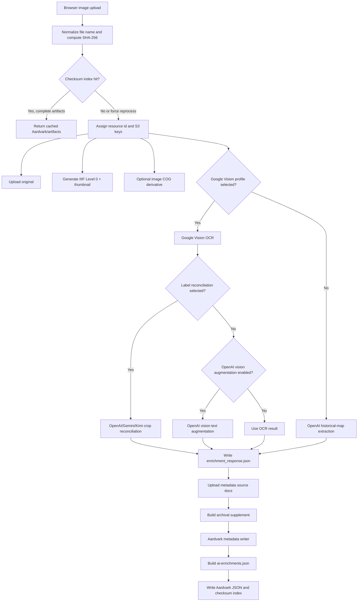
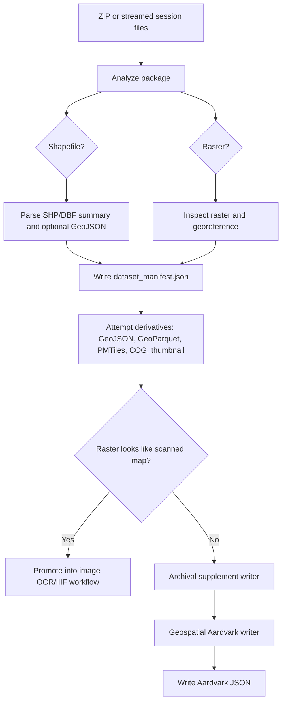

# Enrichment Proxy Module

`web/proxy/enrichment-proxy.mjs` is the local Node.js service behind the Enrichment Workbench. It is intentionally local-first: the browser UI stays static/client-side, while this proxy handles operations that need secrets, filesystem access, native image/geospatial tools, S3-compatible signing, OCR/model calls, and long-running artifact generation.

Run it from `web/`:

```bash
npm run proxy
```

By default it listens on `http://127.0.0.1:8787`. The browser app talks to it through `VITE_ENRICHMENT_PROXY_URL`.

## Responsibilities

The module owns these backend responsibilities:

| Area | What the proxy does |
| --- | --- |
| Local configuration | Loads `.env` files, reads/writes `web/local-enrichment.config.json`, validates that profile fields contain environment variable names rather than raw secrets. |
| S3-compatible storage | Lists objects, signs AWS Signature V4 requests, uploads/fetches artifacts, supports multipart uploads, proxies private artifacts to the browser, and maintains checksum indexes. |
| Image upload processing | Computes SHA-256 fixity, uploads originals, generates IIIF Level 0 tiles and thumbnails, optionally creates COG derivatives, runs OCR/model extraction, writes Aardvark and AI Enrichments JSON. |
| OCR and label extraction | Runs Google Cloud Vision OCR, optional OpenAI vision augmentation, optional OpenAI/Gemini/Kimi crop-based label reconciliation, and merges accepted labels into the extraction document. |
| Aardvark metadata writing | Builds deterministic fallback Aardvark records, calls OpenAI metadata-writer prompts, normalizes controlled values and spatial fields, and records field evidence. |
| AI Enrichments provenance | Builds `ai-enrichments.json` with prompts, calls, redacted request payloads, parsed responses, extracted map text, placenames, field evidence, and gazetteer results. |
| Gazetteer refresh | Runs local WOF, OSM, GeoNames, and canonical OGM concordance layers through imported concordance modules; no public geocoder calls occur at runtime. |
| Geospatial package processing | Analyzes ZIP packages, shapefiles, and georeferenced rasters; writes manifests; attempts GeoJSON, GeoParquet, PMTiles, COG, and preview derivatives; promotes scanned raster maps into the image workflow when appropriate. |
| Artifact previews | Provides proxy/preview endpoints for COGs, rasters, PMTiles, vector GeoJSON, and generated SVG previews. |
| Upload progress | Tracks in-memory job milestones and crop progress for long image/geospatial processing requests. |

## Runtime Model

The module is both an executable service and an importable test target.

```text
web/proxy/enrichment-proxy.mjs
  loads env files
  defines constants and helper functions
  creates http server
  starts listener only when executed directly
  exports selected pure/helper functions for tests
```

The startup guard checks whether the file is the process entrypoint before calling `server.listen`. Tests can import helpers without starting a port listener.

Configuration is loaded on every request through `loadConfig()`. That keeps browser-side profile edits visible immediately, without restarting the proxy.

## Environment Loading

At module load time, `loadEnvFiles()` reads these files in order, without overwriting already-populated environment variables:

```text
web/.env
web/.env.local
process.cwd()/.env
process.cwd()/.env.local
```

Profile fields in `local-enrichment.config.json` should store env var names only:

```text
OPENAI_API_KEY
GOOGLE_CLOUD_VISION_API_KEY
GEMINI_API_KEY
MOONSHOT_API_KEY
AWS_ACCESS_KEY_ID
AWS_SECRET_ACCESS_KEY
```

`validateEnvReference()` rejects strings that look like raw API keys or high-entropy secrets. This is a guardrail against accidentally writing credentials into the ignored local config file.

## Important Environment Variables

| Variable | Default | Purpose |
| --- | --- | --- |
| `ENRICHMENT_PROXY_PORT` | `8787` | HTTP port for the local proxy. |
| `ENRICHMENT_PROXY_CONFIG` | `web/local-enrichment.config.json` | Non-secret profile configuration path. |
| `OGM_METADATA_ID_PREFIX` | `unr` | Fallback Aardvark ID prefix. Storage and batch defaults can override it. |
| `ENRICHMENT_PROXY_S3_LIST_TIMEOUT_MS` | `30000` | Timeout for S3 list operations. |
| `ENRICHMENT_PROXY_S3_OBJECT_TIMEOUT_MS` | `120000` | Timeout for S3 object operations. |
| `ENRICHMENT_PROXY_S3_RETRY_ATTEMPTS` | `3` | Retry count for retryable S3 failures. |
| `ENRICHMENT_PROXY_S3_RETRY_BASE_DELAY_MS` | `750` | Base retry backoff in milliseconds. |
| `ENRICHMENT_PROXY_S3_MULTIPART_THRESHOLD_BYTES` | `67108864` | Switch to multipart upload at or above this size. Minimum is 5 MiB. |
| `ENRICHMENT_PROXY_S3_MULTIPART_PART_SIZE_BYTES` | `33554432` | Multipart part size. Minimum is 5 MiB. |
| `ENRICHMENT_PROXY_MAX_LIST_PAGES` | `1000` | Safety cap for S3 pagination. |
| `GOOGLE_VISION_JSON_LIMIT_BYTES` | `10000000` | Maximum Google Vision JSON payload size. |
| `GOOGLE_VISION_INLINE_IMAGE_MAX_BYTES` | `6500000` | Maximum inline image bytes for a Vision request before resizing/tiling behavior matters. |
| `GOOGLE_VISION_MAX_DIMENSION` | `9000` | Maximum normalized image dimension sent to Vision. |
| `GOOGLE_VISION_MIN_DIMENSION` | `2400` | Minimum target dimension for Vision normalization. |
| `GOOGLE_VISION_TILE_OCR_ENABLED` | `true` | Enables tiled OCR for large images. Set to `false` to disable. |
| `GOOGLE_VISION_TILE_MIN_DIMENSION` | `5000` | Image dimension threshold for tiled OCR. |
| `GOOGLE_VISION_TILE_SIZE` | `3000` | OCR tile size. |
| `GOOGLE_VISION_TILE_OVERLAP` | `320` | OCR tile overlap in pixels. |
| `GOOGLE_VISION_TILE_MAX_COUNT` | `12` | Maximum OCR tile count. |
| `OPENAI_VISION_AUGMENT_OCR_ENABLED` | `true` | Allows OpenAI vision augmentation after Google Vision OCR when no label reconciliation profile is selected. |
| `OPENAI_VISION_AUGMENT_USE_OCR_SOURCES` | `true` | Reuses OCR source regions for OpenAI vision augmentation. |
| `OPENAI_VISION_AUGMENT_MAX_DIMENSION` | `1800` | Maximum dimension for OpenAI augmentation images. |
| `OPENAI_VISION_AUGMENT_MAX_IMAGES` | `GOOGLE_VISION_TILE_MAX_COUNT + 1` | Maximum augmentation images. |
| `GEMINI_TEXT_EXTRACT_USE_SMALL_CROPS` | `true` | Uses small OCR-evidence-ranked crops for Gemini/OpenAI/Kimi reconciliation. |
| `GEMINI_TEXT_EXTRACT_CROP_SIZE` | `1800` | Label reconciliation crop size. |
| `GEMINI_TEXT_EXTRACT_CROP_OVERLAP` | `320` | Label reconciliation crop overlap. |
| `GEMINI_TEXT_EXTRACT_MAX_CROPS` | `64` | Maximum generated label reconciliation crops. |
| `GEMINI_TEXT_EXTRACT_TARGET_CROPS` | `0` | Crop budget. `0` means all generated crops are selected. |
| `AI_ENRICHMENTS_CONCORDANCE_PLACENAME_LIMIT` | `400` | Placename limit for concordance assembly. |
| `ENRICHMENT_PROXY_METADATA_WRITER_TEXT_LIMIT` | `320` | Text segment limit for compact metadata-writer evidence. |
| `ENRICHMENT_PROXY_METADATA_WRITER_TEXT_GROUP_LIMIT` | `180` | Text group limit for compact metadata-writer evidence. |
| `ENRICHMENT_PROXY_METADATA_WRITER_PLACENAME_LIMIT` | `160` | Placename limit for compact metadata-writer evidence. |
| `ENRICHMENT_PROXY_MOCK_OPENAI` | unset | Set to `1` in tests/dev to bypass live OpenAI calls with deterministic mock responses. |

Kimi-specific cache and concurrency settings live in `web/proxy/gemini-text-extraction.mjs`, but requests flow through this proxy. See [Kimi Map-Agent Swarm Pipeline](./kimi-map-agent-swarm.md).

## Configuration Shape

`DEFAULT_CONFIG` is normalized into three profile lists:

| Profile list | Used by | Important fields |
| --- | --- | --- |
| `storageProfiles[]` | S3-compatible object storage | Endpoint, region, bucket, prefixes, public/proxy URL behavior, metadata provider, metadata ID prefix, access-key env names. |
| `modelProfiles[]` | OpenAI, Gemini, and Kimi calls | Provider, model name, API-key env name, model params. |
| `visionProfiles[]` | Google Cloud Vision OCR | API-key env name, OCR feature type, language hints. |

`mergeDefaultModelProfiles()` preserves built-in OpenAI/Gemini/Kimi defaults while allowing local config to define additional profiles. `normalizeStorageProfiles()` cleans metadata ID prefixes and fills fallback values.

## HTTP API Surface

The router is a hand-written `route(req, res)` function. It sends JSON responses through `send()`, supports broad CORS for local browser use, and masks unexpected 500-level errors through `publicErrorResponse()`.

### Artifacts And Previews

| Method | Path | Purpose |
| --- | --- | --- |
| `GET` / `HEAD` | `/api/artifacts/proxy?url=...` | Proxies private artifact URLs through the configured storage profile. Supports range-like browser access patterns through response headers. |
| `POST` | `/api/artifacts/upload` | Uploads an arbitrary artifact object described by JSON. |
| `GET` | `/api/artifacts/cog-info?url=...` | Inspects a COG or raster source and returns normalized raster metadata. |
| `GET` | `/api/artifacts/cog-preview?url=...` | Renders a preview image for a COG, optionally with bbox/size parameters. |
| `GET` | `/api/artifacts/raster-preview?url=...` | Renders a preview for raster artifacts that are not necessarily COGs. |
| `GET` | `/api/artifacts/pmtiles-preview?url=...` | Reads PMTiles and returns an SVG preview of vector features. |
| `GET` | `/api/artifacts/vector-geojson?url=...` | Proxies vector GeoJSON artifacts. |
| `GET` | `/api/artifacts/vector-preview?url=...` | Renders a simple SVG preview for GeoJSON-like vector artifacts. |

### Configuration

| Method | Path | Purpose |
| --- | --- | --- |
| `GET` | `/api/config` | Returns normalized proxy configuration. |
| `PUT` | `/api/config` | Validates and saves non-secret profile configuration. |
| `POST` | `/api/config/test-storage` | Lists objects from the first configured prefix to confirm storage access. |
| `POST` | `/api/config/test-model` | Confirms that OpenAI/Gemini/Kimi credentials can be resolved from env vars. |
| `POST` | `/api/config/test-vision` | Sends a 1x1 PNG to Google Cloud Vision to validate OCR credentials. |

### Storage Inventory And Existing Uploads

| Method | Path | Purpose |
| --- | --- | --- |
| `POST` | `/api/storage/sync` | Lists configured S3 prefixes and returns asset inventory. |
| `POST` | `/api/uploads/processed-resources` | Finds processed upload folders with Aardvark/AI Enrichments artifacts. |
| `POST` | `/api/uploads/aardvark-json` | Fetches an existing S3 `aardvark.json` resource. |
| `POST` | `/api/uploads/regenerate-aardvark` | Re-runs only the metadata writer from existing extraction evidence and artifacts. |
| `POST` | `/api/uploads/refresh-s3-ocr` | Re-runs Google Vision OCR and optional reconciliation for an existing S3 image resource. |
| `POST` | `/api/uploads/refresh-wof-concordance` | Rebuilds persisted AI Enrichments concordance layers from local gazetteer indexes. |

### Enrichment And Upload Processing

| Method | Path | Purpose |
| --- | --- | --- |
| `POST` | `/api/enrich/historical-map` | Ad hoc extraction against an existing storage object. Used for prompt/response preview paths. |
| `GET` | `/api/uploads/jobs/:jobId/progress` | Returns in-memory progress milestones and crop summaries for long-running upload jobs. |
| `POST` | `/api/uploads/process-image` | Full image upload pipeline: upload, IIIF, OCR/model extraction, metadata writing, AI Enrichments, Aardvark JSON. |
| `POST` | `/api/uploads/process-geospatial-package` | Full geospatial ZIP pipeline from browser-provided base64 package bytes. |
| `POST` | `/api/uploads/geospatial-sessions` | Starts a proxy-side large geospatial upload session. |
| `PUT` | `/api/uploads/geospatial-sessions/:sessionId/files?path=...` | Streams one file into an expanded geospatial upload session. |
| `POST` | `/api/uploads/geospatial-sessions/complete` | ZIPs streamed session files, analyzes the package, and completes geospatial processing. |

## Artifact Layout

For image uploads, `uploadKeys()` writes under:

```text
uploads/{resourceId}/
  original_file/{fileName}
  derivatives/{baseName}.cog.tif
  iiif/
    info.json
    full/{width},/0/default.jpg
    {x},{y},{w},{h}/{scaledWidth},/0/default.jpg
  thumbnail/thumbnail.jpg
  metadata_sources/
  enrichment_response.json
  archival_accession_supplement.md
  archival_accession_supplement.json
  ai-enrichments.json
  aardvark.json
```

For geospatial packages, `geospatialUploadKeys()` writes:

```text
uploads/{resourceId}/
  original_file/{fileName}
  dataset_manifest.json
  derivatives/{baseName}.geojson
  derivatives/{baseName}.parquet
  derivatives/{baseName}.pmtiles
  derivatives/{baseName}.cog.tif
  thumbnail/thumbnail.jpg
  archival_accession_supplement.md
  archival_accession_supplement.json
  aardvark.json
```

Checksum indexes live at:

```text
uploads/_checksums/{sha256}.json
```

Those indexes let repeated uploads reuse existing artifacts unless `forceReprocess` is true or the resource needs repair.

## Image Upload Pipeline

`processUploadedImage()` is the main image path.



The pipeline intentionally runs independent work in parallel where possible: original upload, IIIF generation, extraction, and optional COG generation are started together. The workflow only joins when downstream artifacts need the results.

## OCR And Text Reconciliation

There are two high-level image extraction modes:

| Mode | Trigger | Output |
| --- | --- | --- |
| Google Vision OCR first | `visionProfileId` is present | OCR text boxes, text groups, confidence scores, then optional model augmentation. |
| OpenAI direct extraction | No `visionProfileId` | Model extraction over generated image derivatives. |

When OCR-first is selected, the proxy can further augment the OCR:

| Augmentation | Trigger | Imported helper/module |
| --- | --- | --- |
| OpenAI vision augmentation | No text reconciliation profile and `OPENAI_VISION_AUGMENT_OCR_ENABLED !== "false"` | `vision-extraction-augmentation.mjs` |
| Gemini label extraction | Text extraction model profile has `provider: "gemini"` | `gemini-text-extraction.mjs` |
| OpenAI label reconciliation | Text extraction model profile has `provider: "openai"` | `gemini-text-extraction.mjs` |
| Kimi map-agent swarm | Text extraction model profile has `provider: "kimi"` | `gemini-text-extraction.mjs` |

`createTextReconciliationDerivatives()` builds OCR-evidence-ranked crops. If target crop count is `0` or unset, all generated crops are selected. For predictable costs, set one of:

```text
textExtractionTargetCrops
mapLabelReconciliationTargetCrops
geminiTextExtractionTargetCrops
openaiTextReconciliationTargetCrops
kimiAgentSwarmTargetCrops
```

## Aardvark Metadata Writing

The proxy never treats model output as the final authority without normalization. The Aardvark path has three layers:

1. Deterministic fallback builders: `buildAardvarkForUpload()` and `buildAardvarkForGeospatialPackage()`.
2. Model writer prompts: `callAardvarkMetadataWriter()` and `callGeospatialAardvarkMetadataWriter()`.
3. Policy normalization: `normalizeAardvarkResource()` enforces IDs, dates, controlled values, references, spatial syntax, access rights, formats, and fallback behavior.

When a metadata-writer call fails, the proxy logs the failure in job milestones and falls back to deterministic Aardvark metadata. For OCR refreshes, `preserveAardvarkOnWriterFailure` controls whether the existing record is preserved or replaced with a fallback.

## AI Enrichments Assembly

`buildAiEnrichmentsForImage()` converts the processing run into the companion provenance document:

```text
sourceAssets[]
apiCalls[]
prompts[]
extractedMapText[]
textGroups[]
derivedPlacenames[]
mapExtent
derivedMetadata
indexingHints
extensions.*
```

The builder redacts image bytes and sensitive payload values while preserving prompt text, model metadata, call IDs, parsed responses, raw response metadata, OCR evidence, and field evidence.

The concordance layers are imported from smaller modules:

```text
wof-concordance.mjs
osm-concordance.mjs
geonames-concordance.mjs
canonical-concordance.mjs
ai-enrichments-wof-refresh.mjs
```

Runtime matching uses local indexes configured by env vars documented in [Enrichment Workbench](./enrichment-workbench.md). It does not call public WOF, OSM/Nominatim, GeoNames, GNIS, or Wikidata APIs during enrichment.

## Existing Resource Refresh Paths

The proxy includes lower-cost repair and refresh flows for resources already staged in S3.

| Function | Endpoint | What changes |
| --- | --- | --- |
| `regenerateAardvarkForS3Resource()` | `/api/uploads/regenerate-aardvark` | Reads existing `aardvark.json` and `enrichment_response.json`, re-runs metadata writing, rewrites `aardvark.json` and `ai-enrichments.json`. |
| `refreshOcrForS3ImageResource()` | `/api/uploads/refresh-s3-ocr` | Re-fetches the original image, re-runs Google Vision OCR and optional label reconciliation, then rewrites extraction, archival supplement, AI Enrichments, and Aardvark JSON. |
| `refreshWofConcordanceForS3Resource()` | `/api/uploads/refresh-wof-concordance` | Rebuilds local gazetteer layers in `ai-enrichments.json`; creates AI Enrichments from legacy extraction if missing. |
| `fetchAardvarkForS3Resource()` | `/api/uploads/aardvark-json` | Reads an existing Aardvark JSON document from S3. |

Use these before reprocessing originals. They are cheaper and usually safer for prompt, normalization, or gazetteer iteration.

## Geospatial Package Pipeline

Geospatial package processing accepts ZIP files directly or proxy-side upload sessions for expanded directories.



Native tools are optional but improve derivative output:

| Tool | Used for |
| --- | --- |
| `gdalinfo` | Raster inspection and georeference detection. |
| `gdal_translate` | Cloud Optimized GeoTIFF and raster thumbnails. |
| `ogr2ogr` | GeoParquet/format conversion where supported. |
| `tippecanoe` | PMTiles generation for vector packages. |
| `zip` | Proxy-side packaging of large expanded upload sessions. |

Missing tools are recorded as derivative statuses rather than blocking metadata publication when a fallback record is still possible.

## Artifact Preview Helpers

The proxy can inspect and preview artifacts without exposing raw credentials:

| Helper family | Notes |
| --- | --- |
| COG/raster preview | Uses `gdalinfo`/`gdal_translate` when available, with bounded dimensions and timeouts. |
| PMTiles preview | Loads PMTiles and renders a bounded SVG preview using tile request, feature, and coordinate caps. |
| Vector GeoJSON preview | Builds a simple SVG from GeoJSON geometry bounds. |
| Artifact proxy | Maps known storage/public URLs back to signed S3 object requests. |

These paths are designed for browser previews, not authoritative GIS rendering.

## S3-Compatible Storage

Storage access is implemented directly in the module:

| Function group | Purpose |
| --- | --- |
| `objectUrl()`, `listUrl()` | Build S3-compatible object/list URLs. |
| `signS3Request()` | AWS Signature V4 signing. |
| `signedFetch()` | Timeout/retry wrapper for signed S3 requests. |
| `putObjectBuffer()`, `putObjectFile()` | Upload small objects. |
| `putObjectBufferMultipart()`, `putObjectFileMultipart()` | Upload large objects in multipart form. |
| `fetchJsonObject()`, `fetchObjectBuffer()` | Read stored artifacts. |
| `listObjects()` | Inventory configured prefixes with pagination caps. |

The proxy supports AWS S3 and S3-compatible endpoints as long as they accept SigV4-style requests.

## Job Progress

`uploadJobs` is an in-memory map keyed by `jobId`. `createUploadLogger()` appends milestones and logs to stdout. `summarizeUploadJob()` detects crop-level progress from milestone names for Kimi, Gemini, and OpenAI reconciliation.

Progress snapshots include:

```text
status
startedAt
updatedAt
fileName
milestones[]
latest
cropSummary
resourceId or error when complete
```

Jobs are pruned after six hours. Progress is best-effort and not durable across proxy restarts.

## Error Handling And Safety

| Concern | Behavior |
| --- | --- |
| Public errors | `HttpError` messages can be shown to the browser. Unexpected 500s return `Internal server error` and log details server-side. |
| Response sanitization | `safeResponseBody()` removes stack/stacktrace fields before JSON serialization. |
| CORS | `send()` allows local browser access with JSON and range-friendly headers. |
| Secrets | Config validation rejects likely raw credentials; API keys are resolved from env vars. |
| S3 reliability | Retryable S3 statuses/errors are retried with backoff. Multipart uploads are aborted on failure. |
| Temporary files | Geospatial session temp directories are cleaned after completion and periodically pruned. |
| Provider payloads | AI Enrichments records redact inline image bytes while preserving provenance. |
| Runtime geocoding | Gazetteer enrichment uses local indexes only. |

## Public Test Exports

The module exports selected helpers for focused tests:

```text
bboxFields
bboxToAardvarkCentroid
bboxToAardvarkEnvelope
bboxToAardvarkPolygonWkt
buildAardvarkForGeospatialPackage
buildAardvarkForUpload
consolidateOcrTextEntries
cogPreviewRenderOptions
decodeXml
deriveMapLabelPlacenames
effectiveBatchDefaults
generatedAardvarkResourceId
markdownCell
normalizeAardvarkFormat
normalizeAardvarkResource
publicErrorResponse
rasterThumbnailOutsizeArgs
safeResponseBody
selectTextReconciliationTiles
shouldPromoteRasterPackageToImageUpload
```

These exports are intentional seams for tests around geometry conversion, metadata normalization, OCR grouping, preview behavior, error masking, and crop selection.

## Related Files

| File | Relationship |
| --- | --- |
| `web/proxy/gemini-text-extraction.mjs` | Gemini, OpenAI label reconciliation, and Kimi map-agent swarm request/merge logic. |
| `web/proxy/vision-extraction-augmentation.mjs` | OpenAI augmentation of Google Vision OCR output. |
| `web/proxy/wof-concordance.mjs` | Local Who's On First matching. |
| `web/proxy/osm-concordance.mjs` | Local OpenStreetMap matching. |
| `web/proxy/geonames-concordance.mjs` | Local GeoNames matching. |
| `web/proxy/canonical-concordance.mjs` | Local canonical OGM gazetteer matching. |
| `web/proxy/ai-enrichments-wof-refresh.mjs` | Idempotent concordance refresh for persisted AI Enrichments. |
| `web/proxy/map-text-sanity.mjs` | Filters rejected/noisy map text. |
| `web/src/services/EnrichmentProxyClient.ts` | Browser-side client for proxy endpoints. |
| `web/src/ui/enrichments/EnrichmentWorkbench.tsx` | Admin UI that configures profiles and launches workflows. |

## Maintenance Notes

- Keep new route handlers in `route()` grouped by feature area and return through `send()`.
- Prefer adding isolated modules for complex provider/gazetteer behavior, then import them into this proxy. The proxy is already large enough.
- Add or update tests when changing exported helpers, request/response shape, artifact paths, or metadata normalization policy.
- Preserve AI Enrichments provenance when adding provider calls: prompt text, provider/model metadata, redacted request payload, raw/parsed responses, usage, source asset IDs, and call IDs should remain traceable.
- Avoid adding runtime public geocoder calls. Build local source snapshots and indexes instead.
- Treat `forceReprocess`, `skipMetadataWriter`, crop target fields, and cache flags as cost-control surfaces; document any new cost-affecting switch in [Enrichment Workbench](./enrichment-workbench.md).
