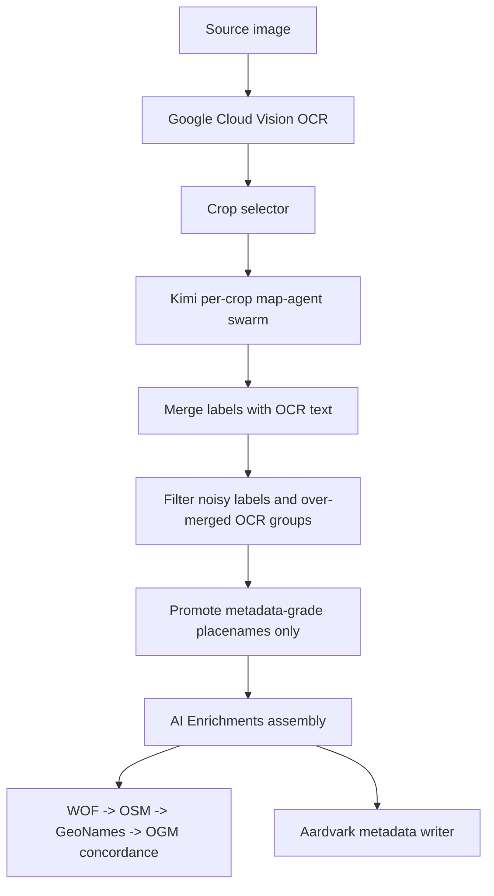

# Kimi Map-Agent Swarm Pipeline

This document describes the direct Moonshot/Kimi path for OCR-assisted map text extraction, structured evidence production, gazetteer-ready placename selection, and cost-aware caching.

The Kimi path is an optional label-reconciliation lane inside the enrichment workbench. It runs after Google Cloud Vision OCR and before Aardvark metadata writing and local gazetteer concordance. Its goal is not to replace OCR. Its job is to turn OCR plus image crops into better reviewable map labels and compact agent claims while keeping street-grid noise out of coverage metadata.

## When To Use It

Use the Kimi profile when a scanned map is dense, visually complex, or likely to benefit from image-grounded label recovery:

- city maps with many labels, docks, terminals, parks, waterways, ferries, and neighborhoods
- maps where OCR sees text but over-merges unrelated labels
- maps where title, legend, scale, temporal notes, and map-body text need to be separated
- batch runs where local response caching can prevent repeat spend during tuning

Do not use it as the silent default for every upload. Kimi is bundled as a selectable profile, but the UI keeps existing OpenAI mini/Gemini reconciliation defaults ahead of Kimi unless Kimi is the only available profile.

## Required Configuration

Add the API key value to `web/.env`:

```bash
MOONSHOT_API_KEY=...
```

The built-in model profile uses:

```json
{
  "id": "kimi-k2-6-swarm",
  "name": "Kimi K2.6 cached map-agent swarm",
  "provider": "kimi",
  "apiKeyEnv": "MOONSHOT_API_KEY",
  "defaultModel": "kimi-k2.6",
  "modelParams": {
    "thinking": { "type": "disabled" }
  }
}
```

The proxy resolves Kimi credentials in this order:

1. the profile's `apiKeyEnv`
2. `MOONSHOT_API_KEY`
3. `KIMI_API_KEY`
4. `KIMI_OPEN_PLATFORM_API_KEY`

Profiles must contain environment variable names, not secret values. If a raw credential was saved into `web/local-enrichment.config.json`, replace it with the env var name and rotate the exposed key.

## Runtime Flow

The Kimi lane is deliberately staged so expensive model calls do not duplicate OCR or gazetteer work.



1. Google Cloud Vision OCR runs once for the image or tile set.
2. The proxy renders a bounded set of source crops from the original image.
3. Each crop receives compact OCR evidence plus the crop image.
4. Kimi returns strict JSON with `labels`, optional `claims`, `agents`, `routing`, and `extractionStatus`.
5. The proxy snaps Kimi label boxes back to OCR support where possible.
6. Accepted labels become searchable extracted map text and reviewable overlay labels.
7. Only metadata-grade features become derived placenames for gazetteer matching.
8. AI Enrichments records the exact prompts, model payloads with image bytes redacted, raw responses, cache metadata, and field evidence.

## Crop Selection

Kimi uses the shared text-reconciliation crop machinery:

- crop ids use the `kimi-swarm-crop-###` prefix
- crop kind is `kimi_agent_swarm_crop`
- crop count defaults to the same target-crop logic as Gemini/OpenAI reconciliation, with Kimi-specific overrides

Relevant request/env controls:

```text
request.kimiAgentSwarmTargetCrops
request.kimiTextExtractionTargetCrops
KIMI_AGENT_SWARM_CONCURRENCY
KIMI_AGENT_SWARM_MAX_COMPLETION_TOKENS
KIMI_AGENT_SWARM_TIMEOUT_MS
```

Default concurrency is `6`, capped at `8`. Default max completion tokens are `16000`. Default per-crop request timeout is `180000` ms; timed-out crops are recorded as failed crop statuses while successful crops continue into the merged extraction.

## Agent Swarm Contract

Kimi is prompted as a gated, evidence-sharing swarm. The model does not literally create independent processes; instead, it is asked to behave like specialized agents that emit comparable structured evidence. This keeps the interface deterministic enough for downstream reconciliation.

Supported agent ids:

```text
map_collar_layout_segmentation
title_date_publisher_extraction
legend_symbology_subject
scale_projection_coordinates
map_body_metadata_text_split
ocr_confidence_repair
spatial_text_clustering
false_positive_suppression
coverage_extent
temporal_coverage
subject_keyword
language_script
collection_context
aardvark_validation
human_review_packet
provenance_evidence_ledger
```

Each crop may run only the agents that have evidence. Weak or irrelevant agents should be marked `skipped` or `needs_more_evidence` rather than forced.

Kimi responses use this shape:

```json
{
  "labels": [
    {
      "content": "LAKE UNION",
      "role": "waterbody",
      "confidence": 0.94,
      "bbox1000": [250, 310, 410, 350],
      "sourceRegionId": "kimi-swarm-crop-001",
      "evidence": {
        "type": "ocr",
        "sourceTextIndices": [42]
      }
    }
  ],
  "claims": [
    {
      "agentId": "title_date_publisher_extraction",
      "field": "dct_title_s",
      "value": "Guide map of Seattle",
      "confidence": 0.92,
      "evidence": [
        {
          "type": "ocr",
          "text": "GUIDE MAP OF SEATTLE",
          "sourceRegionId": "kimi-swarm-crop-004",
          "sourceTextIndices": [345, 347]
        }
      ],
      "warnings": []
    }
  ],
  "agents": [
    {
      "id": "title_date_publisher_extraction",
      "status": "completed",
      "confidence": 0.92,
      "claimCount": 1
    }
  ],
  "routing": {
    "strategy": "per_crop_kimi_agent_swarm_cached_v1",
    "ranAgentIds": ["title_date_publisher_extraction"],
    "skippedAgentIds": ["language_script"],
    "escalationReasons": []
  },
  "extractionStatus": {
    "exhaustive": true,
    "estimatedVisibleTextCount": 40
  }
}
```

Labels are OCR-like visible text. Claims are compact field-level evidence. Claims do not automatically become reviewed Aardvark values.

## Label Roles And Placename Promotion

Kimi can return dense labels, including streets, route numbers, company names, dock labels, legend text, publisher text, and map-body place labels. The merge step keeps accepted labels in extracted map text for search and review.

Gazetteer matching is intentionally narrower. The proxy promotes only metadata-grade placename types into `derivedPlacenames[]`:

```text
landform
landmark
neighborhood
park
railroad
waterbody
```

Street and route labels stay searchable but are not treated as geographic coverage by default. Generic fragments are also suppressed, including labels such as `park`, `bay`, `lake`, `sound`, `station`, `terminal`, `golf`, `puget`, and similar one-word fragments unless they have a stronger role/context.

The merge also prunes short fragments when a stronger same-type phrase contains them. For example, `Bay` should not survive as a placename when `Union Bay` is present with equal or better evidence.

## Gazetteer Integration

The AI Enrichments build now pins Aardvark spatial terms before visual labels. This lets broad catalog context, such as `Seattle (Wash.)`, establish a local boundary before matching dense map-body labels.

The runtime concordance order is:

1. Who's On First
2. OpenStreetMap
3. GeoNames
4. Canonical OGM gazetteer

Selected matches must be backed by extracted map text, text groups, OCR boxes, or conservative adjacent OCR evidence. Metadata-only coverage terms can remain as review candidates, but they should not receive authority matches until text support exists.

## Caching

There are two cache layers, and they solve different problems.

### Kimi Prompt Cache

Each crop request includes a stable `prompt_cache_key` when available. The key is derived from stable local context:

```text
resource id
file name
agent id
source region id
```

The proxy hashes those values and sends a key like:

```text
ogm:3e4f...
```

This is provider-side prompt caching. It can reduce billed input cost when Moonshot recognizes reusable prompt context. Prompt cache keys are preserved in:

```text
parsedResponse.kimi_swarm.promptCacheKeys
extensions.kimiSwarm.promptCacheKeys
apiCalls[].extensions
prompts[].extensions
```

### Local Response Cache

The proxy also caches successful Kimi raw responses locally by exact request-body hash. This prevents repeat spend while tuning prompts, merge rules, or gazetteer logic against the same crops.

Default path:

```text
web/.cache/kimi-agent-swarm/responses
```

Cache controls:

```bash
KIMI_AGENT_SWARM_RESPONSE_CACHE=1
KIMI_AGENT_SWARM_RESPONSE_CACHE_DIR=./.cache/kimi-agent-swarm/responses
```

Disable with any of:

```bash
KIMI_AGENT_SWARM_RESPONSE_CACHE=false
KIMI_AGENT_SWARM_RESPONSE_CACHE=0
KIMI_AGENT_SWARM_RESPONSE_CACHE=no
KIMI_AGENT_SWARM_RESPONSE_CACHE=off
```

A request can also disable cache use with:

```json
{
  "kimiResponseCache": false,
  "kimiAgentSwarmResponseCache": false
}
```

The local cache file stores:

```json
{
  "schemaVersion": 1,
  "cachedAt": "2026-05-30T00:00:00.000Z",
  "outputText": "...",
  "parsedResponse": {},
  "rawResponse": {}
}
```

The request body itself is not stored in the cache file. AI Enrichments records the redacted request payload separately.

Cache writes are opportunistic. If the cache directory is not writable, extraction still succeeds and the cache write error is recorded in the crop cache metadata.

## Provenance In AI Enrichments

Kimi output appears in several parts of `ai-enrichments.json`:

```text
apiCalls[]                         provider/service/model/request/response/usage
prompts[]                          exact rendered system and user prompt text
extractedMapText[]                 merged OCR plus accepted Kimi labels
labelCandidates[]                  accepted semantic labels for map overlay review
derivedPlacenames[]                metadata-grade placename candidates and matches
extensions.kimiSwarm               claims, agents, routing, crop statuses, usage
extensions.textExtractionGraph     label candidates and Kimi swarm claims
```

Kimi call ids and provider ids:

```text
call-kimi-map-agent-swarm
hybrid_google_vision_kimi_agent_swarm
per_crop_kimi_agent_swarm_cached_v1
```

Inline image bytes are redacted before persistence. The source image, derivatives, checksums, crop metadata, prompts, model parameters, response metadata, and raw parsed output remain available for audit.

## Failure Behavior

Kimi failures are non-fatal to the upload when Google Vision OCR has already succeeded. If the Kimi path fails, the proxy logs the error and preserves the Google Vision OCR result with a debug field:

```text
debug.kimi_agent_swarm_error
```

Per-crop failures are also tolerated when at least one crop succeeds. The aggregate extraction status records:

```text
cropCount
successfulCropCount
failedCropCount
omittedReason
cropStatuses[]
```

If every Kimi crop fails, the Kimi augmentation throws and the caller falls back to the OCR result.

Malformed JSON can still be partially useful. The parser attempts to salvage complete label objects from a malformed `labels` array and marks the extraction as non-exhaustive with an omitted reason.

## Review Guidance

Human review should focus on:

- ambiguous gazetteer matches
- labels with projected, non-OCR-backed geometry
- generic feature labels that look tempting but lack a proper name
- publisher cities or legend terms that look like places
- temporal claims that may confuse publication date with depicted/surveyed/revised dates
- broad coverage terms that have no map-text backing

The map viewer should show the Text panel with meaningful groups expanded and noisy street-grid labels collapsed by default:

```text
Title & Publication
Legend & Scale
Water Bodies
Terrain / Elevation
Landmarks & Parks
Neighborhoods / Districts
Streets & Routes       collapsed
Reference / Grid       collapsed
Other Labels           collapsed
```

Street labels remain valuable for search and visual review, just not for coverage metadata.

## Cost Controls

The pipeline is designed to avoid a naive "many agents read everything" cost pattern:

- OCR runs once.
- Kimi receives crop-specific OCR slices, not the entire image context repeatedly.
- Claims are compact and evidence-referenced.
- Street labels are not sent into full gazetteer expansion by default.
- Local response caching prevents repeat vendor calls during tuning.
- Provider prompt cache keys are stable per crop.
- Kimi is selectable, not the silent default.

For bulk processing, tune:

```bash
KIMI_AGENT_SWARM_CONCURRENCY=6
KIMI_AGENT_SWARM_MAX_COMPLETION_TOKENS=16000
KIMI_AGENT_SWARM_TIMEOUT_MS=180000
KIMI_AGENT_SWARM_RESPONSE_CACHE=1
```

Start with small batches, inspect `extensions.kimiSwarm`, and only increase crop count/concurrency after reviewing quality and spend.

## Operational Checklist

1. Add `MOONSHOT_API_KEY` to `web/.env`.
2. Start the proxy from `web/` so relative cache paths resolve under `web/.cache`.
3. Select a Google Cloud Vision OCR profile.
4. Select `Kimi K2.6 cached map-agent swarm` in the label-reconciliation dropdown.
5. Run the upload or OCR refresh.
6. Review the Text panel and `ai-enrichments.json`.
7. Inspect `extensions.kimiSwarm.cropStatuses` for cache hits, failed crops, and prompt cache keys.
8. Review ambiguous/unmatched gazetteer candidates before treating matches as catalog metadata.

## Implementation References

Primary proxy implementation:

```text
web/proxy/gemini-text-extraction.mjs
web/proxy/enrichment-proxy.mjs
```

UI profile selection:

```text
web/src/ui/enrichments/EnrichmentWorkbench.tsx
web/src/duckdb/enrichments.ts
```

Tests:

```text
web/proxy/gemini-text-extraction.test.mjs
web/proxy/*concordance*.test.mjs
```

Related docs:

```text
docs/enrichment-workbench.md
docs/ai-enrichments.md
docs/gazetteer.md
```
